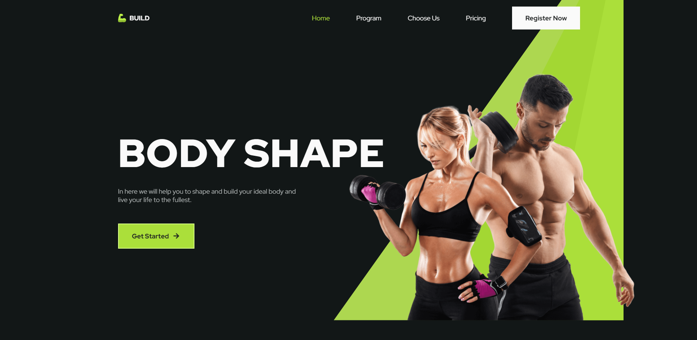

# [💪 ](https://github.com/bedimcode/responsive-gym-website/blob/main/README.md#-responsive-gym-website-design)SWEAT BLOOD

## Sweat Blood

* Sweat Blood is a responsive Gym Website Design Using HTML CSS & JavaScript
* Contains animations when scrolling.
* Includes a form to calculate body mass index.
* Includes a form to send emails.
* Developed first with the Mobile First methodology, then for desktop.
* Compatible with all mobile devices and with a beautiful and pleasant user interface.

## Website Image

